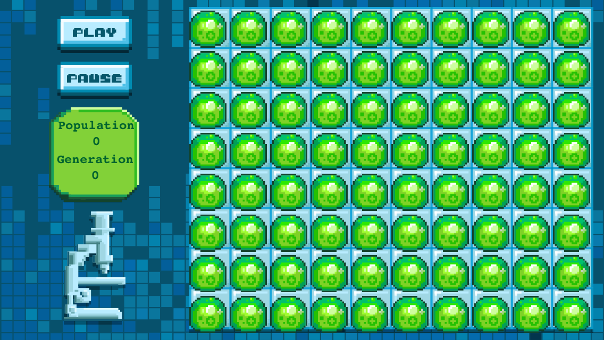
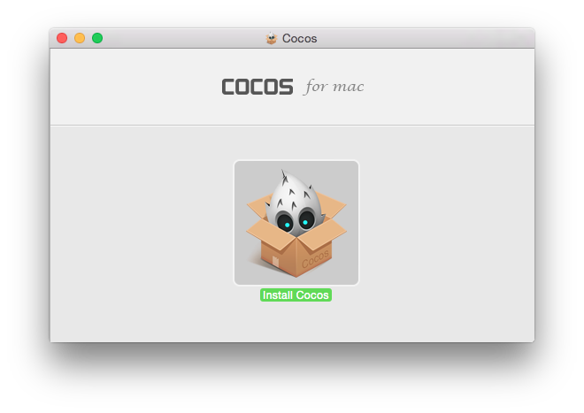
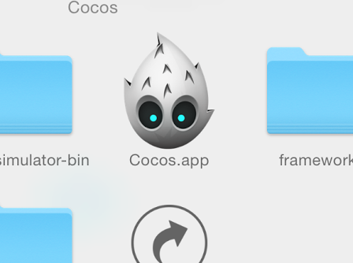
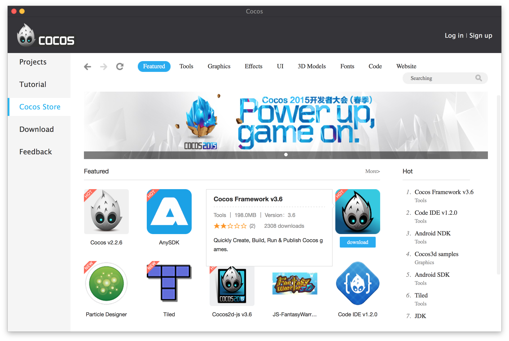
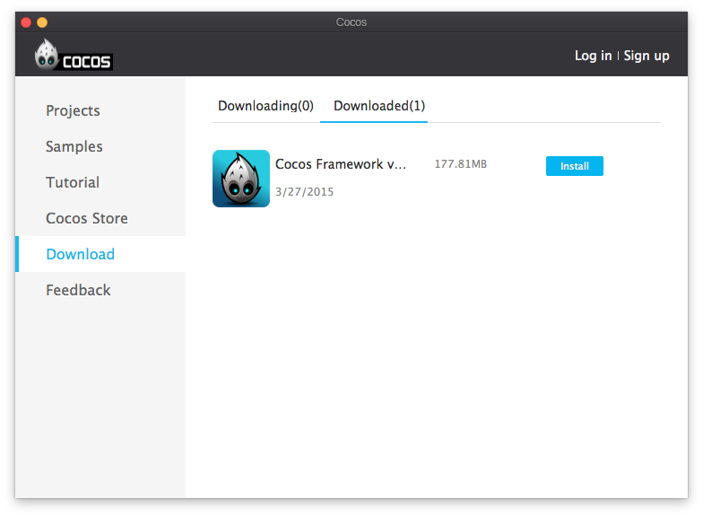

Installation
============

We are going to use a tool called Cocos Studio to make this game. When
we are done, the game will look like this:

> [action]
Go to [the Cocos2d-x downloads page](http://www.cocos2d-x.org/download)
and download the latest version of Cocos. It's free! Make sure you download Cocos, and not Cocos2d-x (which is the game engine source code), or Code IDE (which is a development environment for using Cocos2d-x with Javascript or Lua)  

> [action]
Run the installer. 

It should place a folder called Cocos in your Applications folder. 

Some More Setup
===============

Before you can create your first project, you'll first have to do some setup.  
> [action]
Open the Cocos App:

> [action]
Go to the store, and download the latest version of the Cocos2d-x framework.

This will download precompiled versions of the Cocos2d-x game engine, which will be used in your new project.

> [action]
Install the downloaded Cocos Framework:

Cocos Studio Basics
====================

Cocos Studio's main goal is to provide a tool similar to Xcode's
Storyboard but for Cocos2d-x games.

Cocos Studio is a visual editor that allows you to rapidly create
Cocos2d-x games. It enables you to create user interfaces, gameplay
scenes, and levels by dragging different components to different
*interface files* and arranging their positions. This can save a lot of
time compared to positioning every element on the screen in code.

Cocos Studio also includes tools to manage
your assets, create animations, and particle effects. We
will get to these advanced features towards the end of this tutorial.

Cocos Studio Workflow
======================

When you use Cocos Studio for your game, you start by creating a new
Cocos Studio project instead of an Xcode project. When creating a
Cocos Studio project, Cocos Studio will create and maintain an Xcode, Visual Studio,
and Eclipse projects for you.

Inside the Cocos Studio project you will organize all the resources and
assets for your game. You will also create interface files for the different
scenes in your game. The interface files are called .csd files. Cocos Studio also
allows you to create *code connections*. With code connections you can
create links between .csd files and your C++ classes. This means you
can add behavior to your game's objects in Cocos Studio *and* in code -
we will discuss this concept in depth later.

In general your workflow with Cocos Studio will look like this:

-   Create a new project in the Cocos App
-   Add images and other resources to your Cocos Studio project
-   Create multiple .csd files for the different scenes and objects in
    your game
-   Add code connections to extend the behavior of these scenes and
    objects
-   *Publish* your project in Cocos Studio. This will update the Xcode
    project that is linked to your Cocos Studio project
-   Run your game from Xcode

When you run your game from Xcode, a component called *CSLoader* will
read all the .csd files from your Cocos Studio project and create
Cocos2d-x scenes and nodes (the basic classes in Cocos2D-x) out of them.

Read on to learn how to create your first project!
