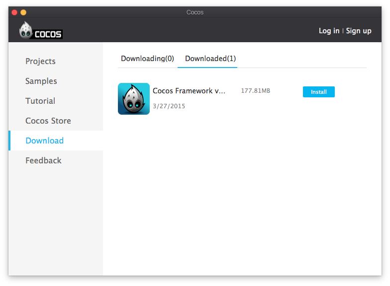
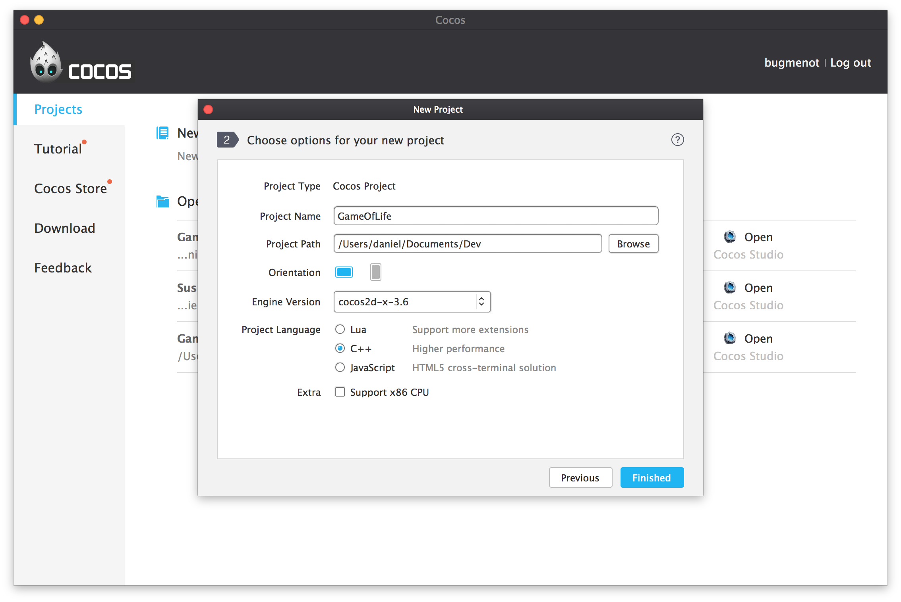
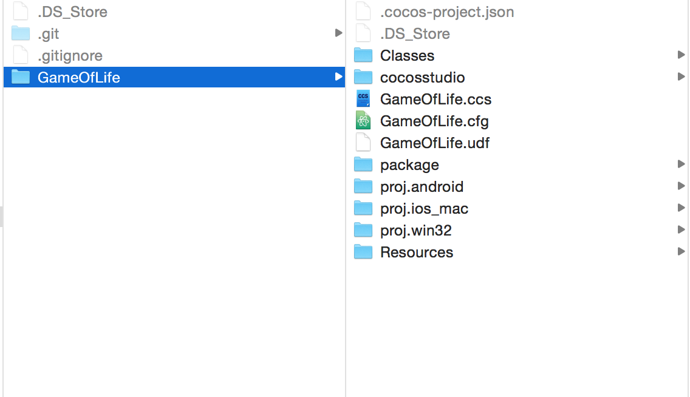
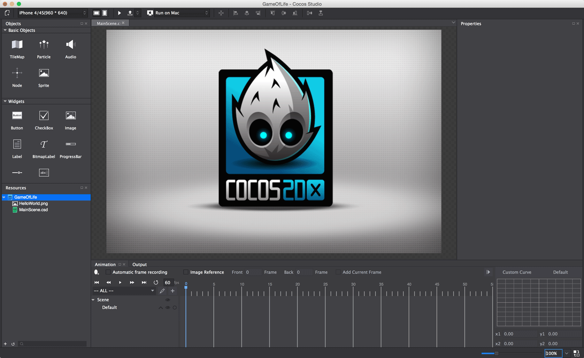
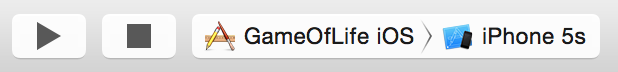
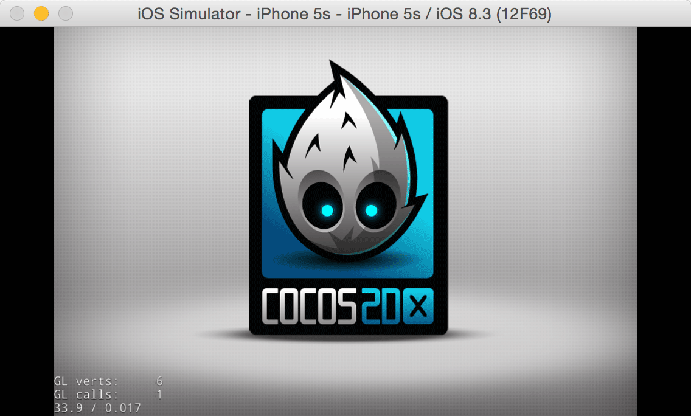

---
title: Create a New Project in Cocos Studio
slug: create-new-project-cocos-studio
---       

Before you can create your first project, you'll first have to do some setup.  Open the Cocos App:

Go to the store, and download the latest version of the Cocos2d-x framework.

This will download precompiled versions of the Cocos2d-x game engine, which will be used in your new project.

Install the downloaded Cocos Framework:

Now we're set up and ready to create a new Cocos Studio project:

Create a new Cocos Project:

Name your new project “GameOfLife”. Select the latest engine version, and set the orientation to landscape.  Also make sure you select C++ as your project language:

Once the project is created, open
Finder and take a look at the folder structure of your project. If you
can't find your project in Finder, search for it using Spotlight at the
top right of your screen. 

The folder structure should look something
like this:

SpriteBuilder created a new folder called *GameOfLife*. Inside it
is a Cocos Studio project named *GameOfLife.ccs*.  It also created an Eclipse-based Android project in *proj.android*, an OSX and iOS Xcode project in *proj.ios_mac* and a Windows and Windows Phone Visual Studio project in *proj.win32*. The C++ classes you'll be writing are stored in the *Classes* directory, which is read by all three projects.  The assets and resources used by your game (like images, fonts, sounds and Cocos Studio binary files) are kept in the *Resources* directory.

The default Cocos Studio project comes with one scene, *MainScene.csd*. Your
empty project should look like this:

Testing your setup
==================

Let’s make sure everything was generated correctly. Click on the *Publish and Package* 
button in Cocos Studio:

Change the Publish Type to *Publish to Xcode* and click *OK*

Now navigate to the *proj.ios-mac* directory and open *GameOfLife.xcodeproj* to view the project in Xcode. Press the play button in Xcode to run the project on the iOS Simulator.

Verify it shows the Cocos2d-x logo:

Congratulations! Now you have run your first Cocos Studio project and
you know your tools are working.