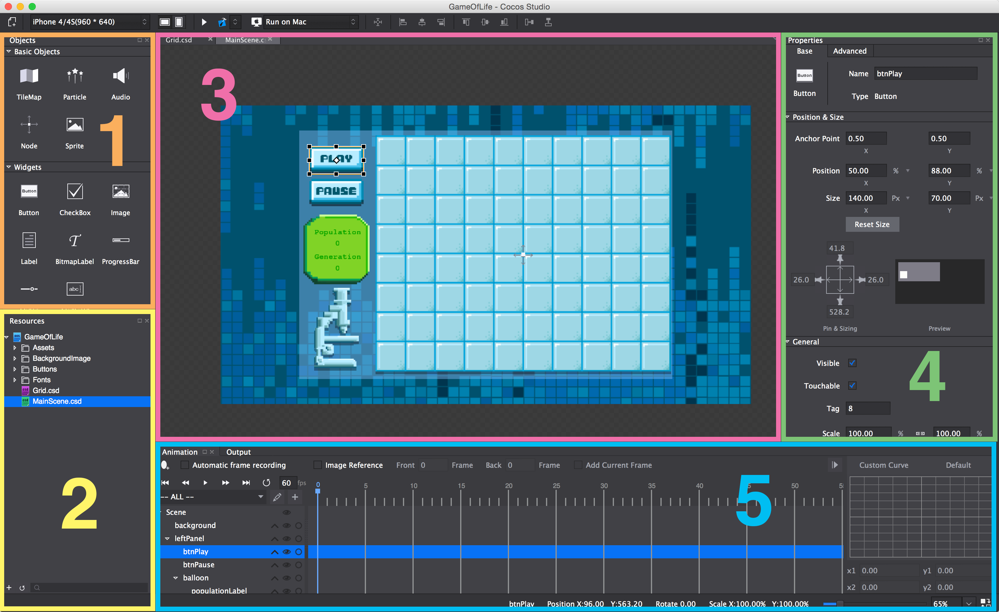
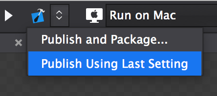

---
title: Cocos Studio's User Interface
slug: cocos-studio-user-interface
---       

Let's take a quick tour of Cocos Studio's user interface before we delve into creating our game.

The interface is divided into five main sections:

1.  *Objects Browser* - This is where you
    can select different types of objects and drag them into your scene.
2.  *Resources Browser* - Here you can see the resources, scenes and custom nodes you have created or added to your project. These can be dragged into the current scene. You can rearrange the resources on your filesystem, and add new resources to your project by clicking the + button in the lower left-hand corner.
3.  *Stage* - The stage is a preview your current scene. Here you can
    arrange the nodes that belong to a scene.  You can preview 	 different screen resolutions with the dropdown above the Objects 	 Browser.
4.  *Properties Pane* - When you select a node in your scene, this properties
    pane will display a lot of editable information about that node. You
    can modify positions, anchor points, content 
    (the text of a label, for example) and other properties. The *Advanced* tab allows you to create code connections: interface points with your code. For example, buttons can have custom callback methods, a chunk of code that is executed when the button is clicked.
5.  *Animation Timeline* - The timeline is used to create animations within
    Cocos Studio. We will look at this in more detail later on.

Publishing to Xcode
===================

Every time you make a change to your Cocos Studio project, you must *publish* it so that your changes are reflected in the Xcode project.  The first time you publish, you should click *Publish and Package...* and select the *Publish to Xcode* radio button. Every subsequent time you publish, you can click *Publish Using Last Setting* in the dropdown.  Remember to publish every time you make a change!

**Now you're ready to add content to your very first Cocos Studio
game!**