---
title: Create the Game of Life's User Interface
slug: game-of-life-ui
---       

Now it's time to create the interface for the game in Cocos Studio. Once you are done with this chapter the UI of the game will look like this:

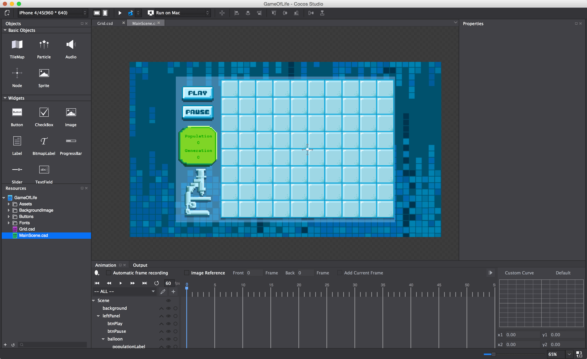

Getting Started
===============

Get started by downloading our [art pack](Assets.zip) for this game.

After you have unzipped it, drag the *Assets* folder into your
Cocos Studio project onto the Resources Browser in left panel. Alternatively you can right click in the Resources Browser and *Import Resources...*.
	
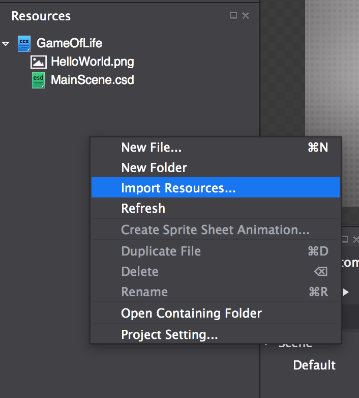

After importing the assets, your Resources Browser should look like this

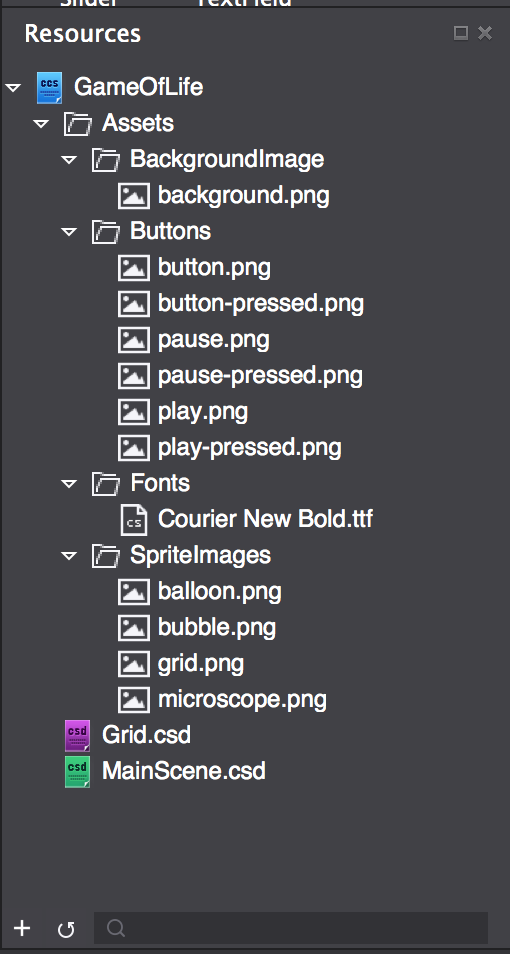

Now open *MainScene.csd* and highlight Default in the timeline.
Hit the delete key - you should end up with a black screen. You just deleted the default background image, but note that you cannot delete the root Scene. 

In the Resources Browser in the left panel, find *HelloWorld.png* and delete it - you don't need it anymore.

Check to make sure that your design resolution (in the top-left hand corner) is set to *960 x 640*. This is the resolution at which we'll design the game in Cocos Studio.

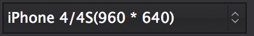

Add a Background Image
======================

Drag *background.png* to the stage of *MainScene.csd*. We want to center the background in the scene. To do that, we'll set the *anchor point* and *position* properties of the background image.

The *anchor point* is the point inside that the node that will be moved to whatever *position* coordinates you specify. It's also the point around which the object will be rotated when you modify the *rotation* property.

First, ensure that the anchor point is set to (0.5, 0.5). The anchor point is a coordinate inside the object - it's expressed in percentages from 0 to 1.  In this case, (0.5, 0.5) means (50%, 50%) which will place the anchor point in the middle of the background. 

Now set the background position to be expressed in *%Relative percentage of parent container* by clicking the dropdown that says *Px*. Then set the values to (50, 50). This will set the background's position to (50, 50) of the parent node. By expressing the position of the background in percentages instead of absolute coordinates we make our layout more flexible. That's because, even if the parent node's size changes, the background will remain the middle.

Finally, set the background *scale* to 120% horizontal and 120% vertical. This will ensure that the background is large enough to cover the screen on all iPhones.

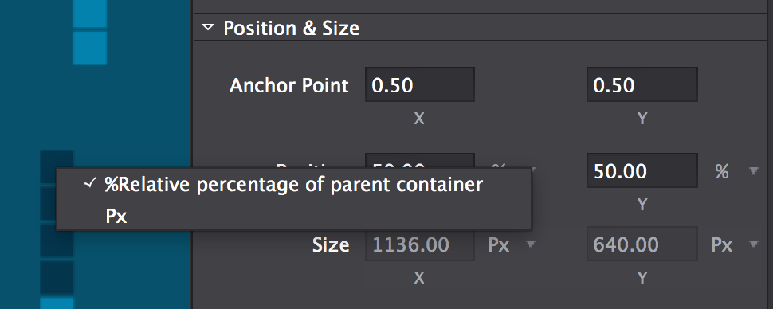

Create Layout Panels
====================

To help ensure that our UI resizes dynamically for various screen resolutions, we're going to use two *Panels* which are a type of *Container Node*.  We will have a left panel for the play button, pause button, labels and microscope, and a right panel that will hold the grid.  

Drag a Panel container from the Objects Browser in the left panel (you may have to scroll down to find it). Set the anchor point to (0, 0.5), the position to *%Relative percentage of parent container* and the postion to (0, 50).  This will pin the panel to the middle left of the screen.  Set the size to *%Relative percentage of parent container* and (20, 100). Finally, change the name to *leftPanel*. In the code we'll refer to the objects created in Cocos Studio by their names, so it's important that we give them good ones.

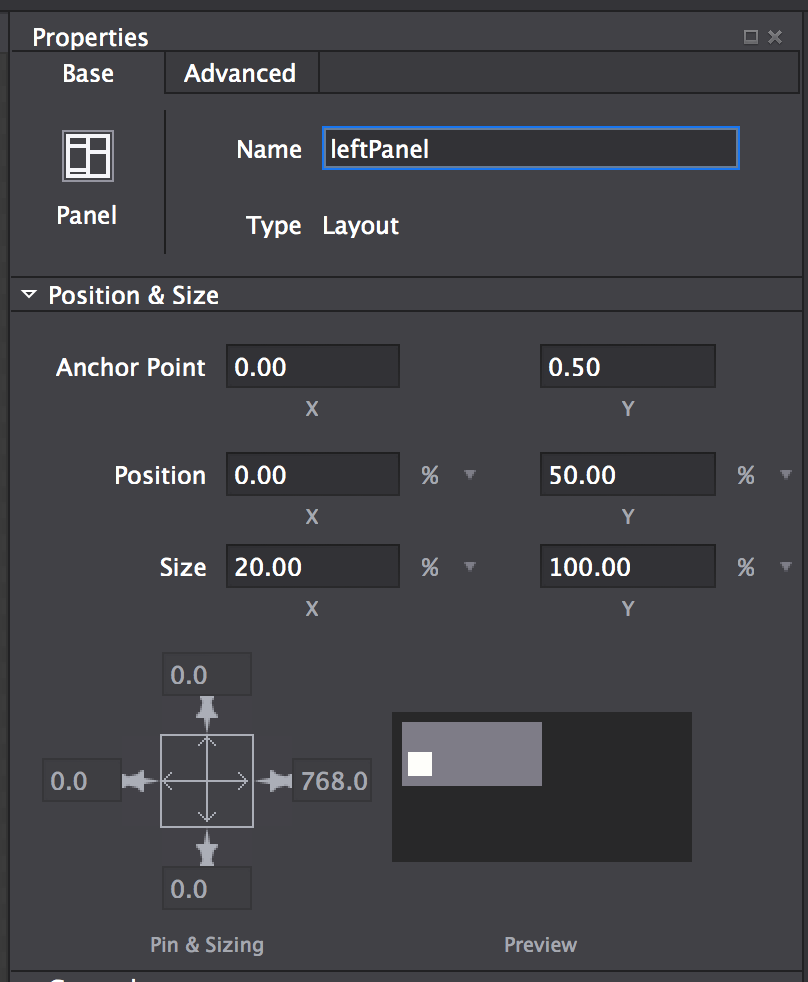

Now we'll create the right panel. Drag another Panel container into the scene from the Objects Browser. Set the anchor point to (0, 0.5). Set the position to *%Relative percentage of parent container* and (20, 50). Set the size to *%Relative percentage of parent container* and (80, 100). Change the name to *rightPanel*.

So now your timeline should look like this:

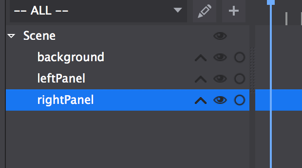

Creating a Grid
===============

We will create the grid in a separate .csd file because it will be linked to a custom class later on. Create a new .csd file *File --> New File* of type *Node* and call it *Grid*.

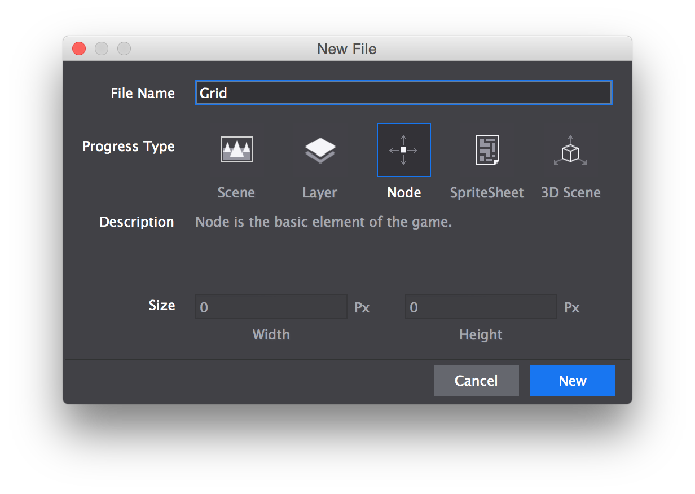

Find Grid.png in the Resource Browser and drag it into the your newly created Node. Set the position to (0, 0) to center it.

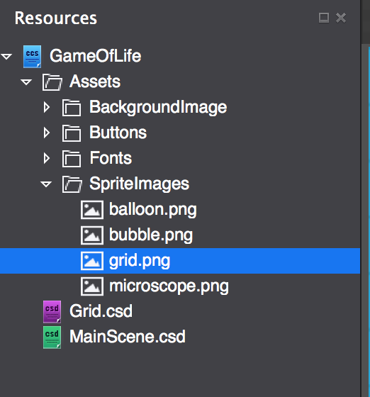

Change the name of the newly-dragged grid sprite to *grid*.

**Make sure to save your newly created file (cmd + s) or your grid will not display correctly later on!**

Add the Grid to the MainScene
=============================

Now open *MainScene.csd* again by double clicking on it. 

Drag *Grid.csd* onto the stage. This will add the grid to the
MainScene. Rename it to gridNode. In the timeline, drag gridNode to become a child of rightPanel. 

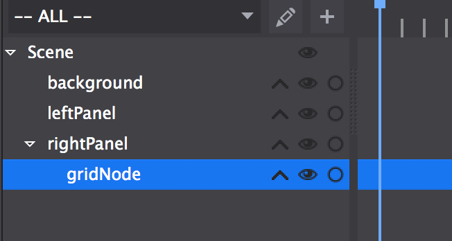

Set the position of gridNode to (50%, 50%).

Game UI
====================

Great! Now it is time to set up your game's UI! We're going to add the play and pause buttons, the game labels and the microscope sprite to the scene.  All of these will go on the left side of the screen, so make sure they're children of leftPanel.

Drag two buttons (you can find them in the Widgets section of the Objects Browser) into the scene. Name one *btnPlay* and the other *btnPause*. Make sure they both have an anchor point of (0.5, 0.5).  Set the size of both to (140px, 76px). Position btnPlay at (50%, 88%) and btnPause at (50%, 75%). Delete the default "Button" text for both.

Double click the *Normal State* property for btnPlay. Navigate to and select play.png. Alternatively, you can drag and drop the images from the resources panel over to *Normal State* property on the properties panel.

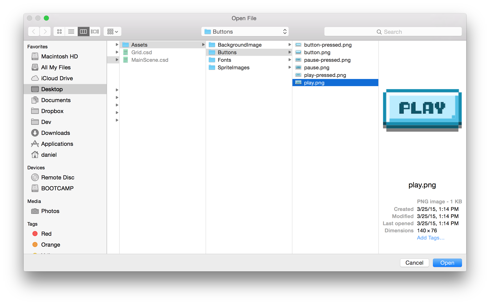

For *Press State* select play-pressed.png. Do the same for btnPause with pause.png and pause-pressed.png.

Now go to your resources and add *balloon.png* and *microscope.png* to leftPanel. Set the anchor points of both to (0.5, 0.5). Name the balloon sprite "balloon" without the quotes.  Position balloon at (50%, 52%). Position the microscope at (50%, 20%).  

When you are done it should look like this:

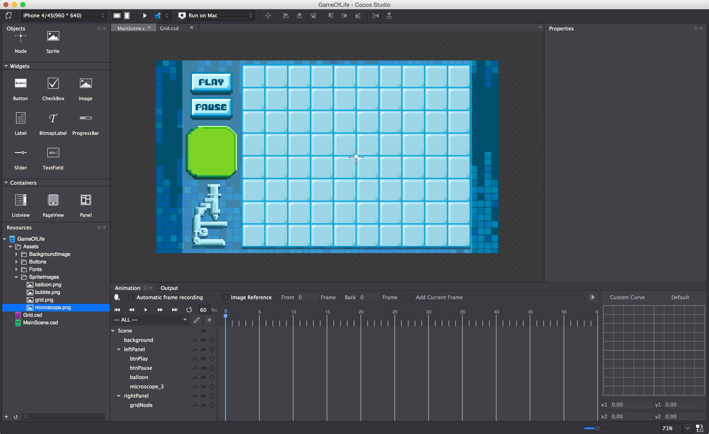

In the next step add four labels as children of the balloon, these will form our scoreboard. To do so, go back to the Objects Browser, find the Widget called *Label* (not *BitmapLabel*), and drag one of them onto the scene. Scroll down to the bottom of the label's properties and click the *Font file* button. Select Courier New Bold.ttf from the Fonts directory. Set the size to 20, and the color to #0D9F00. Copy and paste that label 3 times, then fill out the labels according to the following table.

<!-- Unfortunately, no markdown table support yet -->

<table>
	<thead>
		<tr>
			<th align="center">Label Name</th>
			<th align="center">Label Text</th>
			<th align="center">Position</th>
		</tr>
		</thead>
		<tbody>
		<tr>
			<td>populationLabel</td>
			<td>Population</td>
			<td>(52%, 75%)</td>
		</tr>
		<tr>
			<td>populationCount</td>
			<td>0</td>
			<td>(52%, 59%)</td>
		</tr>
		<tr>
			<td>generationLabel</td>
			<td>Generation</td>
			<td>(52%, 40%)</td>
		</tr>
		<tr>
			<td>generationCount</td>
			<td>0</td>
			<td>(52%, 23%)</td>
		</tr>
	</tbody>
</table>

<!-- 

| Label Name      | Label Text | Position   |
|-----------------|------------|------------|
| populationLabel | Population | (52%, 75%) |
| populationCount | 0          | (52%, 59%) |
| generationLabel | Generation | (52%, 40%) |
| generationCount | 0          | (52%, 23%) |

-->

When you're done it should look like this:

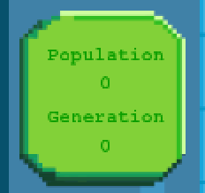

Great!

Copy Resources
=======================

Now save, and publish to Xcode.

We have to do one more thing before we start coding. The way Cocos Studio works, it only publishes resources that are actually used in Cocos Studio. However, there are images that we want to use in code that we haven't used in Cocos Studio, namely *bubble.png* that we will use to make Creatures.

To make sure we can access all the resources in Xcode, we'll copy the Assets directory from where Cocos Studio reads them into the publish directory.

Navigate to your project directory and open *cocosstudio*. Copy the *Assets* directory.

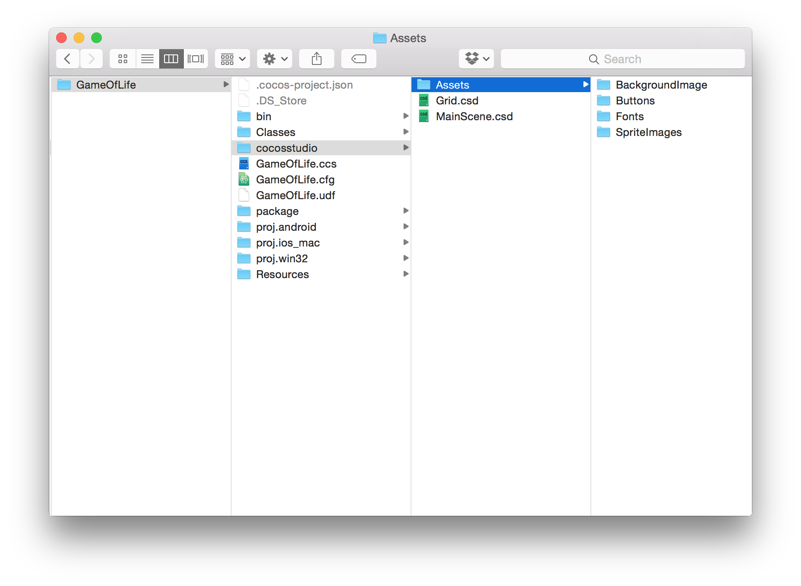

Then open *Resources* and *res*. Paste the Assets directory here. Choose yes if it asks you whether you'd like to overwrite Assets.

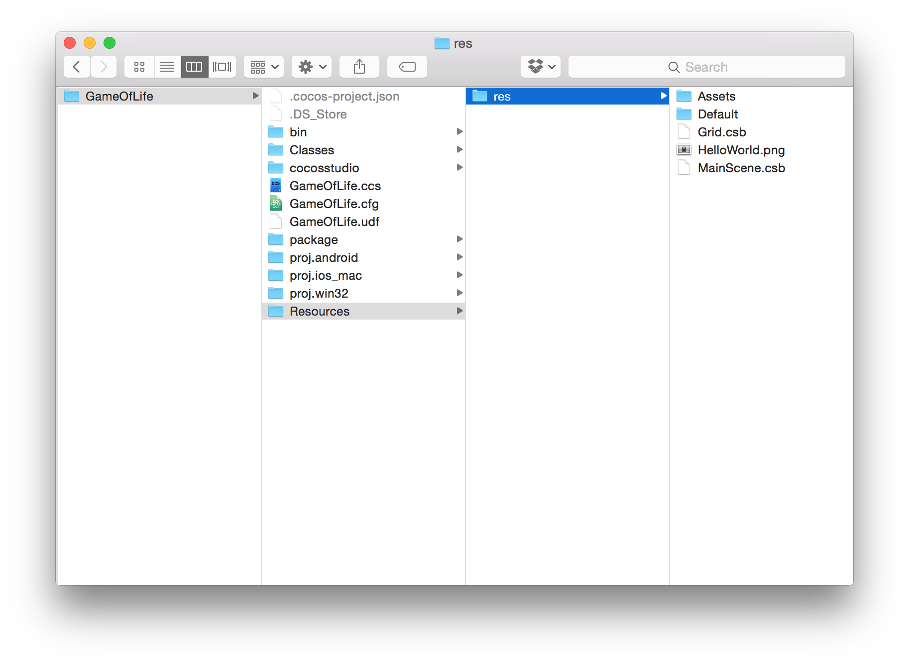

Now all the assets from the art pack will be accessible in your Xcode project.